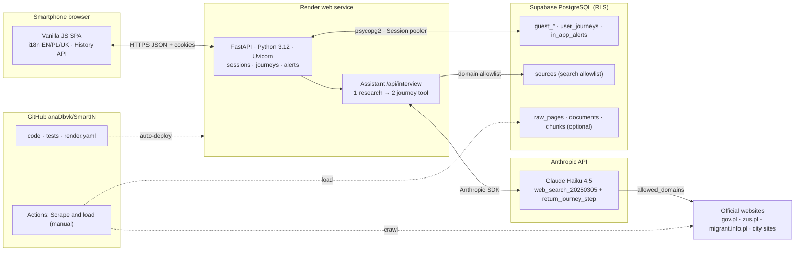
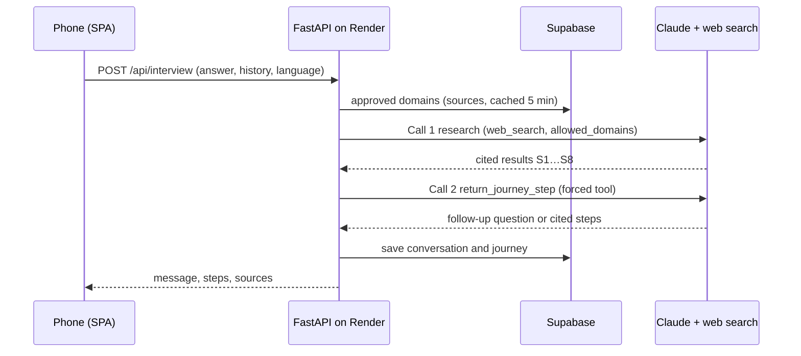

# SmartIN architecture

Editable source: [`architecture.svg`](architecture.svg).

## Chat turn

## Key technologies

| Layer | Technology |
| --- | --- |
| Frontend | Vanilla JavaScript SPA, HTML, CSS, self-hosted Lexend/Public Sans, i18n (EN/PL/UK), History API |
| Backend | Python 3.12, FastAPI, Pydantic, Uvicorn, httpx/requests |
| AI | Anthropic Claude Haiku 4.5, server web search tool restricted to official domains, forced tool output |
| Data | Supabase PostgreSQL, psycopg2, JSONB journeys, row-level security, Session pooler |
| Hosting & CI | Render (Blueprint `render.yaml`, auto-deploy), GitHub, GitHub Actions |
| Scraper (optional) | requests, BeautifulSoup, lxml, robots.txt, PII redaction |
| Security | HMAC-hashed phone IDs, HttpOnly cookies, secrets only in environment variables, rate limiting |
