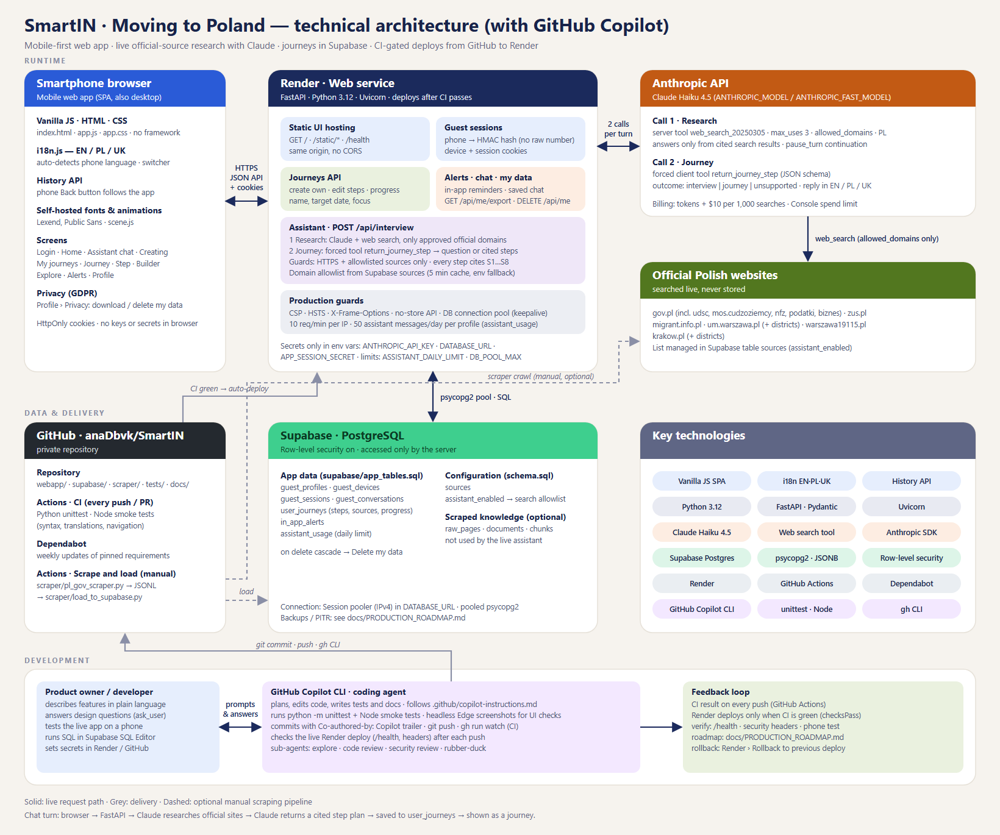
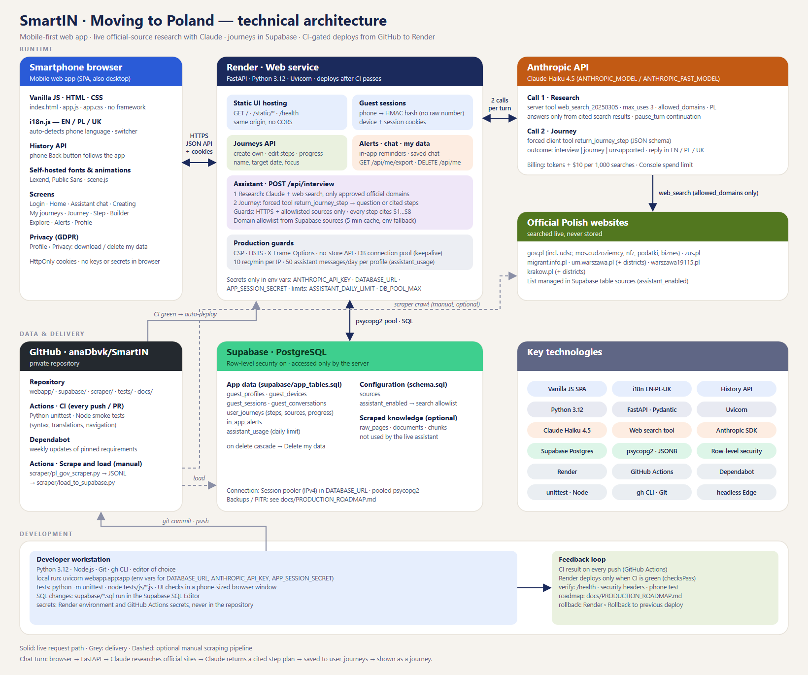
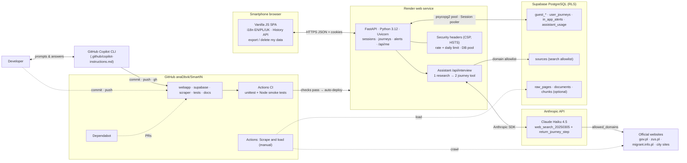
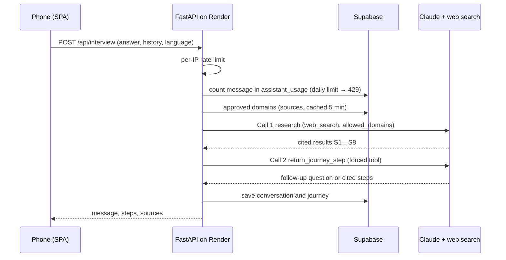
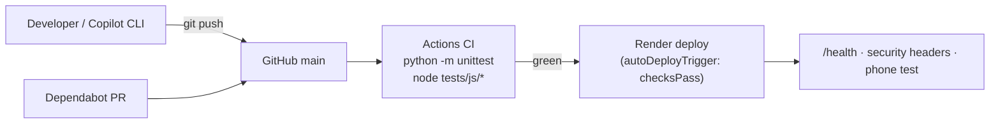

# SmartIN architecture

## Diagrams

### With GitHub Copilot (development loop)



### Without GitHub Copilot



The SVG sources are [`architecture.svg`](architecture.svg) and
[`architecture-no-copilot.svg`](architecture-no-copilot.svg). They are
generated by [`build_diagrams.py`](build_diagrams.py):

```powershell
python docs/build_diagrams.py
# PNG export, for example with headless Edge:
msedge --headless --window-size=1640,1370 --screenshot=docs/architecture.png docs/architecture.svg
```

## System overview



In the version without Copilot, the developer commits and pushes directly
(the dotted `DEV → CODE` edge). Everything else is the same.

## Chat turn



## Delivery



## Key technologies

| Layer | Technology |
| --- | --- |
| Frontend | Vanilla JavaScript SPA, HTML, CSS, self-hosted Lexend/Public Sans, i18n (EN/PL/UK), History API |
| Backend | Python 3.12, FastAPI, Pydantic, Uvicorn, Anthropic SDK |
| AI | Anthropic Claude Haiku 4.5, server web search tool restricted to official domains, forced tool output |
| Data | Supabase PostgreSQL, psycopg2 with a connection pool, JSONB journeys, row-level security, Session pooler |
| Hosting | Render (Blueprint `render.yaml`, deploy after CI passes) |
| Source control & CI | GitHub, GitHub Actions (Python `unittest`, Node smoke tests), Dependabot |
| Development | GitHub Copilot CLI (coding agent guided by `.github/copilot-instructions.md`), `gh` CLI, headless Edge for UI screenshots |
| Security | CSP, HSTS, HMAC-hashed phone IDs, HttpOnly cookies, secrets only in environment variables, per-IP and daily limits, GDPR export/delete |
| Scraper (optional) | requests, BeautifulSoup, lxml, robots.txt, PII redaction |
